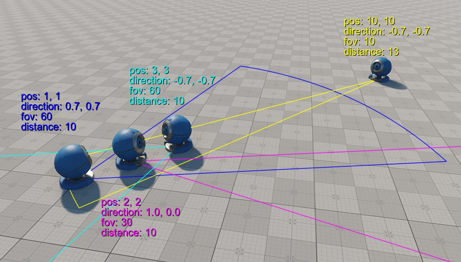

# задание:

### Требования:
 с++14, консольное приложение, без сторонних библиотек, windows/linux x64

### Задание:
Нужно написать алгоритм, который для каждого юнита из массива определяет, сколько других юнитов попадает в его поле зрения.

Юнит представлен в виде:
```c++
struct unit
{
    vec2 position; // 2D позиция
    vec2 direction; // нормализованный вектор-направление
    float fov_deg = 0.0f; // угол зрения в градусах (0...180)
    float distance = 0.0f; // дальность видимости
};
```

Алгоритм нужно реализовать в виде функции:

```c++
void Task::checkVisible(const std::vector<unit> &input_units, std::vector<int> &result)
{
    // fill result vector 
}
```

На вход функция получает константный вектор юнитов (где 1 <= input_units.size <= 10^5), и вектор целых числел который нужно заполнить. 

> Представляем, что эта функция часть какой-то игры и нужно реализовать только тело функции не внося изменения в остальной код и ее сигнатуру. (Пример вызова этой функции есть в main.cpp) 


### Example:
in_units
```
{{1.0, 1.0}, {0.707106, 0.707106}, 60.0, 10.0},
{{3.0, 3.0}, {-0.707106, -0.707106}, 60.0, 10.0},
{{2.0, 2.0}, {1.0, 0.0}, 30.0, 10.0},
{{10.0, 10.0}, {-0.707106, -0.707106}, 10.0, 13.0}
```
results:
```
2, 2, 0, 3
```



### В архиве вы найдете несколько файлов:

часть "игры" - то, что **нельзя** модифицировать. 
- `bin/input.txt` - пример входного файла
- `include/сommon.h`
- `include/task.h`
- `source/main.cpp`
- `CMakeLists.txt`

то, что вы **можете** модифицировать:
- `source/task.cpp` - должен содержать реализацию функции `checkVisible`. **В качестве ответа прислать только этот файл!**


Опционально (или то, на что мы обращаем внимание):

- Читабельность и чистота кода
- Алгоритмическая сложность
- Производительность
- Минимум аллокаций на куче
- Многопоточность
- Векторизация
